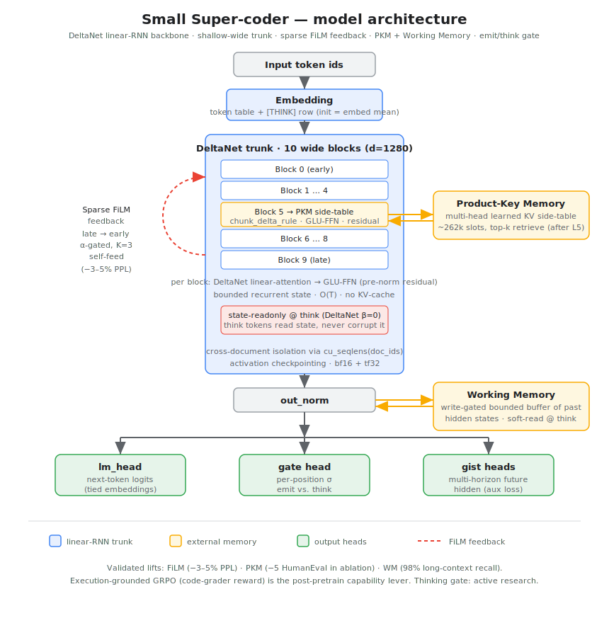

# state-dep-parallel

A **cheap, bounded-state coding agent** research program on tight compute
(2× RTX 5090): the moat is **COST** (O(1)/constant-memory decode) and
**ADAPTIVITY**, not benchmark rank. Engineering details and the resolved
current state live in [`AGENTS.md`](AGENTS.md); framing in
[`NORTH_STAR_2026_06_30.md`](NORTH_STAR_2026_06_30.md) and
[`THESIS.md`](THESIS.md).

## Key findings & results

1. **O(1) decode is a real, unbounded memory moat.** Flat 8.2 MiB recurrent
   state and ~919 MiB decode peak from 512 to 131k context, vs a
   transformer's KV cache growing 20→5121 MiB (6.45× at 131k, still
   widening). → [`DECODE_COST_BENCH.md`](DECODE_COST_BENCH.md),
   [`SCOREBOARD.md`](SCOREBOARD.md)
2. **Latent Execution: externalize before you internalize.** Latent-first
   training provably fails; text-scratchpad-first then Coconut-style
   compression carries ~6 hops of real program state in continuous thoughts
   (per-hop decode 0.844, depth-true R-signature; the ~6-hop horizon matches
   two independently published continuous-thought limits). Full paper draft:
   → [`PAPER_LATENT_EXECUTION_DRAFT.md`](PAPER_LATENT_EXECUTION_DRAFT.md),
   program log [`EXEC_TRACE_LATENT_PLAN.md`](EXEC_TRACE_LATENT_PLAN.md)
3. **Inheritance + anneal campaign: a competent bounded-state base.**
   SmolLM2-360M linearized into DeltaNet (bit-exact MLP/embed copy + MOHAWK
   + KD), then a 3B-token plateau + 0.3x curated anneal decay + 3-seed soup:
   HumanEval-solution CE 0.969 (scratch) → **0.6614**, 0.047 from the
   softmax donor, at O(1) decode. Recipe laws found on the way: anneal
   strength does NOT transfer across scales; N-seed decay-soup strictly
   dominates. → [`IDEAS_2026_07_13.md`](IDEAS_2026_07_13.md) (Tier-1
   kill-tests log)
4. **Token-poverty is the binding constraint, not architecture.** Half-size
   SmolLM2-135M beats our 287M from-scratch trunk on code CE from a
   ~400–800× token deficit — inheritance/KD is the only coherent path to a
   competent sub-1B base at this budget.
   → [`STRATEGY_2026_06_28.md`](STRATEGY_2026_06_28.md)
5. **Converged trunks defend themselves.** Attaching WM/FiLM to a converged
   base fails in BOTH possible directions under a fair frozen-trunk pre-warm
   protocol: standard-mix pre-warm → the trunk suppresses the feature;
   niche-dense pre-warm → the feature engages and *harms* the base. Day-1
   co-training is the only path these mechanisms have.
   → [`IDEAS_2026_07_13.md`](IDEAS_2026_07_13.md) (attach registrations)
6. **Delta-rule states compose in parallel; sequential accumulation is the
   bottleneck.** Mean-merged per-segment "cartridge" states retain ~all of
   sequential ingestion's benefit at working scale (line-CE retention 0.99
   [CI 0.82–1.40]) and beat one long sequential state on hard tokens — but
   sequential ingestion itself HURTS beyond the trained window (−0.54
   span-CE at 8–32k), improves 75% with T=8192 packing training, then
   saturates exactly at the window (2x tokens = flat). Merging is free; the
   wall is window-bounded state extrapolation.
   Full paper draft:
   → [`PAPER_STATE_COMPOSITION_DRAFT.md`](PAPER_STATE_COMPOSITION_DRAFT.md);
   program logs [`STATE_CARTRIDGES_PLAN_2026_07_19.md`](STATE_CARTRIDGES_PLAN_2026_07_19.md),
   [`LONGCTX_PLAN_2026_07_19.md`](LONGCTX_PLAN_2026_07_19.md)
7. **Meta-TTT: two clean kills.** Meta-training the recurrent state into a
   deliberate test-time learner did not beat incidental state-learning on
   held-out repos (pre-registered, engagement-guarded).
   → [`META_TTT_PLAN_2026_07_13.md`](META_TTT_PLAN_2026_07_13.md)
8. **RL sharpens, it doesn't create.** The pass@k envelope (~18–21/164) is
   set by the SFT/base distribution; grader-RL moves greedy (3→7) inside it.
   Verifier-arbitrated best-of-N is the cheap win.
   → [`AGENTS_HISTORY.md`](AGENTS_HISTORY.md)

Full chronological arc and superseded claims:
[`AGENTS_HISTORY.md`](AGENTS_HISTORY.md) ·
[`SESSION_FINDINGS.md`](SESSION_FINDINGS.md)

## Architecture



## Stack

- **DeltaNet** backbone — bounded-state linear RNN, no KV-cache cost.
  (`gated_deltanet` is broken on sm_120; plain `deltanet` works.)
- **Shallow-wide trunk** — 10L × 896d + 5 dense reverse-FiLM pairs + K=3
  self-feed. Iso-param swap of the 30L × 576d trunk; ~18 % faster wall-clock,
  matches/beats it on VAL ppl.
- **Sparse FiLM feedback** — the headline architectural finding (below).
- **Working Memory** — write-gated bounded buffer addressed by a **learned,
  no-hash contextual name-span key**, with a **copy/pointer readout** that mixes
  a copy distribution into the logits at recall positions. Read on the **emit
  path** (always-on, gated to recall answer-spans), *not* behind the think token
  — see the thinking note below. Useful exactly when the recurrent state
  *saturates* (more items than fit in it): co-trained into pretrain it is
  load-bearing leak-free — first-occurrence const recall **0.03 → 0.98**
  (WM-on vs recurrence-off) at 1 B tokens. See "Making each feature load-bearing".
- **Product-Key Memory** — 262 k learned KV slots after one block. Load-bearing
  on HumanEval (−5 in ablation) once the v7.1 bootstrap-fix package is used.
- **Thinking** — two coupled mechanisms: a per-position emit/think **gate**
  (optionally taught *where* to think by an execution-grounded gate-calibration
  loss), and **latent (Coconut-style, high-bandwidth) thinking** for the
  computation — the trunk's own continuous hidden fed back as the next input for
  R state-readonly steps, trained by a depth-matched reasoning loss. *Status below.*
- **Mixed-corpus pretrain** with cross-document state isolation (`cu_seqlens`
  from per-position `doc_ids`), and a **day-1 co-trained stack** that trains
  every mechanism above together from the first step (latest: the v17
  all-features run) with per-feature usefulness tracking (see below).
- **Execution-grounded RL** ([`train_rl_grader.py`](experiments/train_rl_grader.py))
  — GRPO with a dense `code_grader` reward. The post-pretrain capability lever.

## Current status (honest)

- **Best HumanEval pass@1: ~13–15/164** (`rl_grader_phase_c_v2_step300`,
  KL-stable GRPO on the Chinchilla-completed 287 M base). **Honest caveat**:
  greedy HumanEval-164 is a noisy dev signal at this scale — a same-config
  re-measurement clusters runs at ~13–15 **with SFT ≈ RL** (the SFT→RL gain ≈ 0),
  and the historical "16" is not robustly reproducible (one draw from a ~13–17
  noise band). Treat ≥1-point deltas with suspicion; use temp-sampled pass@k or a
  larger bench for real comparisons. See `STRATEGY_2026_06_28.md`.
- **Validated primitives**: FiLM (−3–5 % PPL), PKM (−5 HumanEval ablation),
  WM (first-occurrence recall 0.03→0.98 leak-free, co-trained). These earn their
  place on their own metrics — *not* on the HumanEval headline.
- **Thinking — latent and co-trained.** Discrete-token thinking does not
  amplify on this trunk; **latent (high-bandwidth, Coconut-style) thinking** is
  the working primitive, validated on synthetic reasoning and real
  arithmetic-chain transfer. Because a mechanism bolted onto a converged trunk
  stays inert, thinking is now **co-trained from day 1** (the v17 all-features
  run, latent reasoning staggered to start once PKM has bootstrapped). We
  **require a measured thinking contribution before scaling on it**. Full trail
  in `AGENTS.md`.
- Dead ends documented so they aren't repeated: discrete-token thinking
  (never amplifies on this trunk), gate aux loss targeting the wrong
  mechanism, latent thinking as a post-hoc bolt-on (regresses VAL),
  continuation SFT/DPO on off-distribution data (regresses).

## Making each feature load-bearing

Adding a module is never enough — it has to be *conditioned* so the optimizer
actually uses it, and *probed* so we can prove it contributes. The working
designs:

- **Working Memory — learned no-hash name-span addressing + copy readout.** The
  hard-won lesson: the addressing failure was never softmax, it was a
  *non-separable key* (cosine over content payloads cross-talks). The working
  addresser is a **learned continuous key pooled on the identifier name-span**
  (dot-product attention over the trunk's contextual hidden, supervised by a
  `ctx_addr_aux` attention loss), paired with a **copy/pointer readout** that
  copies the addressed source span into the logits — the additive read residual
  is frozen off, so recall flows entirely through the copy head. Reads are
  **always-on, on the emit path** at recall answer-spans (the first-occurrence
  mask — recall must be supervised *where recurrence fails*, not at a restated
  answer), *not* gated behind the rarely-firing think token. Co-trained into
  pretrain this is load-bearing leak-free: first-occurrence const recall
  0.03 → 0.98 at 1 B tokens; deployed-gate syn64 +0.76 / syn128 +0.53
  (strengthening 500 M → 1 B). Reliable on identity/symbol recall (the bulk of
  code recall); fully disjoint *semantic* recall is the next step.
- **PKM — the v7.1 bootstrap package.** Output-gate α + sign-preserving
  α-floor, ε-greedy slot exploration, residual-magnitude value init, LayerNorm
  score-norm, and a 100× value-table LR — together turning a near-dead table
  into an always-positive per-source contribution. (The earlier diversity
  penalty was dropped — it was an inert no-op; exploration is held by ε-greedy +
  LayerNorm + the value-LR.)
- **Thinking — latent reasoning co-trained from day 1, with an optional gate
  teacher.** The computation is **latent (Coconut-style) thinking**, trained by
  a depth-matched reasoning loss on a pointer-chase corpus (R=2…8 curriculum,
  staggered to start after PKM bootstraps). The gate can additionally be taught
  *where* to think by a gate-calibration loss (compare post-latent-think vs
  no-think `logp(true)`, train toward "think iff it helps"; latent rollouts apply
  `lm_head` only at the think slot via `skip_lm_head` to stay cheap). That gate
  teacher is **off in the current day-1 run** — it destabilizes a cold trunk —
  so the gate currently learns from the LM/entropy losses while latent reasoning
  carries the computation.
- **Co-train from day 1, and measure it.** Every mechanism is trained together
  from the first step (not bolted on post-hoc, which leaves it inert), on a
  recall-heavy data mix so WM's state actually saturates, with a periodic
  **ablation-delta probe** (zero each feature, watch CE rise) that makes each
  mechanism's load-bearing-ness visible *during* training rather than guessed
  from VAL ppl.

## Headline architecture finding

**A single sparse late-to-early FiLM connection in a DeltaNet stack gives a
robust ~3–5 % PPL lift that survives a 3.3× param scale-up and an optimizer
change.** One late-layer output (lagged 1 token) modulates an early layer via
FiLM with one learnable scalar α (+0.3 % params).

| Setup | DN baseline | + Sparse FiLM | Δ |
|---|---|---|---|
| 217 M / AdamW / 5 K  | 51.00 | 49.40 (2,28) | **−3.1 %** |
| 360 M / Muon / 15 K  | 22.79 | 21.57 (2,28) | **−5.4 %** |
| 708 M / Muon / 15 K  | 35.38 | 34.26 (2,34) | **−3.2 %** |

3-seed reproducibility at 217 M: 49.40 ± 0.31 (σ < 1 %). K=3 self-feeding
closes the train/inference gap → −1.5 % lift at **1× decode cost**, with RNN
inference state 74× smaller than a matched Transformer's KV cache.

**Mechanism**: the lift comes from a negative-α subtractive basin reachable
*iff* (i) modulation is multiplicative (FiLM-form, not Q-K-V additive) and
(ii) cross-source aggregation is non-softmax (sum or sigmoid; softmax dilutes
by 1/K). 20+ controlled ablations; either condition failing breaks the basin.

**Honest framing**: cross-architecture (vs Transformer) the comparison is
scale/optimizer-dependent — Transformer wins at 360 M/Muon. What's robust is
the lift *within* the linear-RNN family. The top-down-feedback idea isn't new
([GF-RNN][gfrnn] 2015, [BRIMs][brims] 2020); the contribution is the
*minimal-form demonstration + mechanism* in a modern linear-RNN coding LM.

## Build

```bash
# Python (uv + cu132 nightly torch + local flash-linear-attention fork)
uv venv .venv && source .venv/bin/activate
uv pip install torch --index-url https://download.pytorch.org/whl/nightly/cu132
uv pip install numpy
uv pip install -e /home/knielsen/ml/flash-linear-attention   # Blackwell fixes
export PYTHONPATH=$PYTHONPATH:.

# Lean library (StateDep/) — requires elan + lake
cd StateDep && source $HOME/.elan/env && lake exe cache get && lake build
```

## Reproduce the headline finding

```bash
# DeltaNet baseline vs Sparse-(2,28) FiLM (codeparrot, T=512, batch=8, lr=3e-4)
python experiments/train_lm.py --arch deltanet --feedback none \
  --steps 5000 --d_model 576 --n_heads 9 --d_head 64 --n_layers 30
python experiments/train_lm.py --arch deltanet --feedback film \
  --feedback_pairs "2,28" --steps 5000 --d_model 576 --n_heads 9 \
  --d_head 64 --n_layers 30
```

[gfrnn]: https://arxiv.org/abs/1502.02367
[brims]: https://arxiv.org/abs/2006.16981
